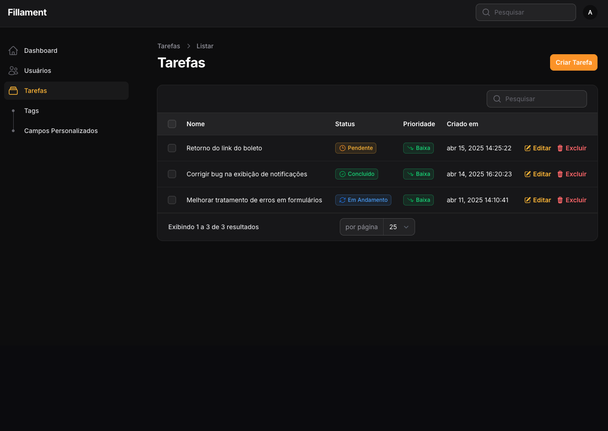
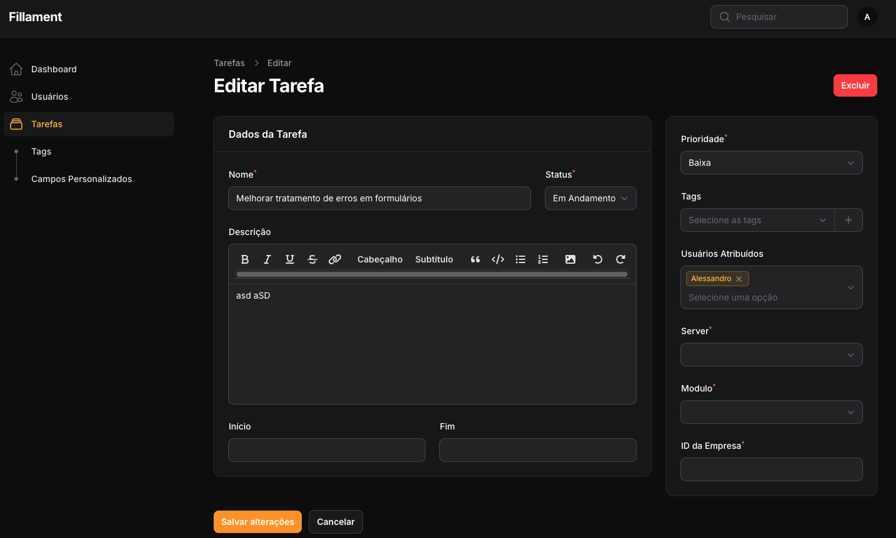
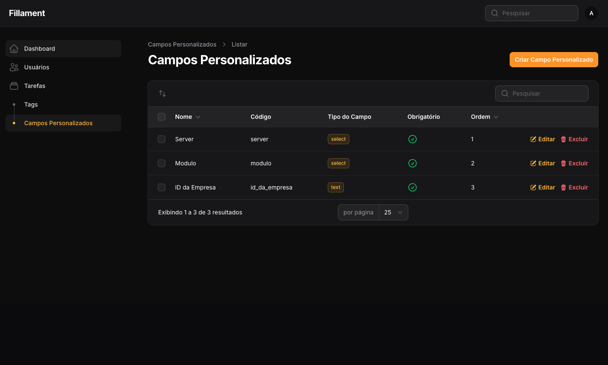
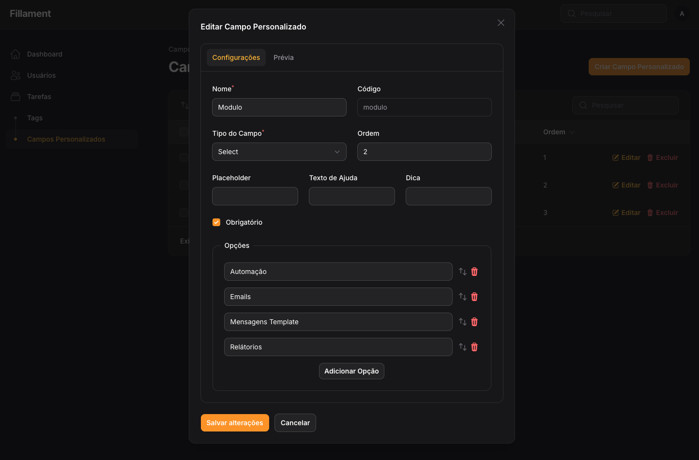
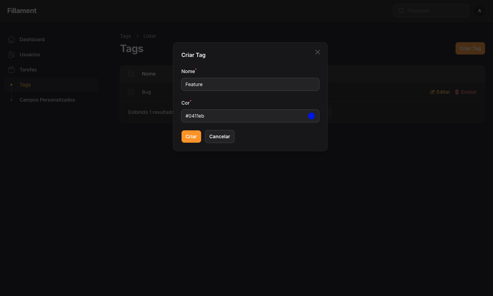

# Laravel Tasks Management

Task management system for Laravel with Filament support, which includes features for user assignment, comments, priorities, statuses, and task types kanban.

## Features

- Task management with CRUD operations
- Task assignments to users
- Task priorities and status management
- Team support (optional)
- Comments on tasks
- Task notifications (configurable)







## Requirements

- PHP 8.2 ou superior
- Laravel 11.x
- Filament 3.x

1. Install the package:
```bash
composer require alessandronuunes/tasks-management
 ```

2. Publish and run the migrations:
```bash
php artisan vendor:publish --tag=tasks-management-migrations
php artisan migrate
 ```

3. Publish the configuration file:
```bash
php artisan vendor:publish --tag=tasks-management-config
 ```

 4. Publish the language files:
```bash
php artisan vendor:publish --tag=tasks-management-translations
 ```

## Configuration

The package configuration file will be published at config/tasks-management.php . Here you can:

- Enable/disable team support
- Configure models
- Setup notifications
- Enable/disable widgets

You can set the default locale in the configuration file:
```php
'locale' => 'pt_BR', // or any other locale
```
Configure default behavior for actions:

```php
'actions' => [
    'create_another' => false, // Controls the createAnother behavior in forms
],
```
To enable team support, update your configuration:

```php
'use_teams' => true,
'models' => [
    'team' => App\Models\Team::class,
]
 ```
### Adding to Filament
Add the plugin to your Filament panel provider:

```php
use Alessandronuunes\TasksManagement\TasksManagementPlugin;

class AdminPanelProvider extends PanelProvider
{
    public function panel(Panel $panel): Panel
    {
        return $panel
            // ... other configurations ...
            ->plugins([
                TasksManagementPlugin::make()
                    ->authorizedUsers([ 'admin@admin.com' ])
                    ->userQueryModifier(fn ($query) => $query->positionNotNull()),,
            ]);
    }
}
 ```

## Customization
You can customize the behavior of the package by:

1. Extending the models
2. Modifying the configuration
3. Publishing and modifying the views
4. Extending the resources

## License
The MIT License (MIT). Please see License File for more information.

## Contribuição
Contributions are welcome! Feel free to open an issue or submit a pull request.

## Autor
Alessandro Nuunes de Oliveira
